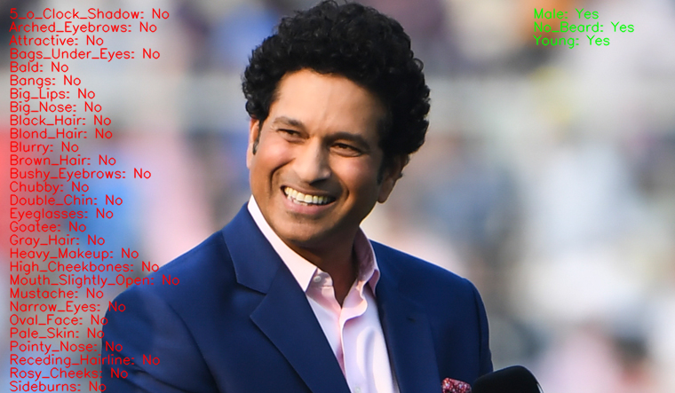
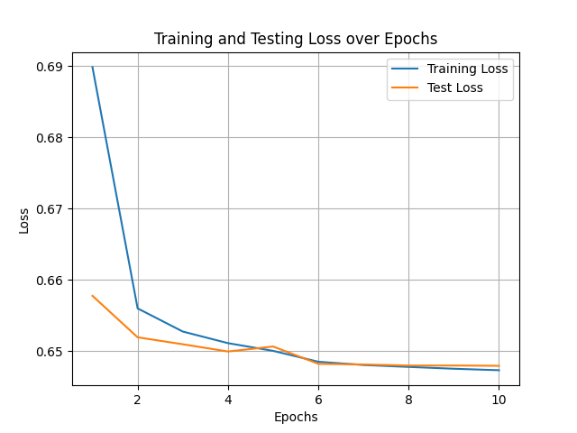

# CelebA Multi-Task Learning Model

This project involves a multi-task learning architecture implemented using PyTorch to classify attributes of images from the CelebA dataset. The model is designed to predict 40 binary attributes for each image, using a shared convolutional backbone and separate fully connected heads for each attribute.



## Table of Contents

- [Installation](#installation)
- [Dataset](#dataset)
- [Training](#training)
- [Inference](#inference)
- [Requirements](#requirements)
- [Results](#results)

## Installation

Clone this repository and navigate to the project directory:

```bash
$ git clone https://github.com/Mohammed-Rahman-sherif/MultitaskLearningWithCelebA.git
$ cd MultitaskLearningWithCelebA
```

Install the necessary dependencies using the provided `requirements.txt` file:

```bash
$ pip install -r requirements.txt
```

## Dataset

The CelebA dataset is used for this project. It contains images of celebrities along with annotations for 40 attributes. The dataset is automatically downloaded using the `torchvision.datasets.CelebA` class.

## Training

The multi-task learning model is trained to predict 40 different attributes for each image. The training script includes the following:

- A shared convolutional backbone to extract features.
- Separate fully connected heads for each attribute.
- Adaptive learning rate scheduling using `StepLR`.
- Saving the best model during training to ensure optimal performance.

To train the model, run the following command:

```bash
$ python src/MultiTask.py
```

This will train the model for 10 epochs (you can adjust the number of epochs) and save the best model as `CelebA_best_model.pt`.

## Inference

To perform inference on a new image from a URL, you can use the function `infer_new_image_from_url()` provided in the script.

Example:

```python
image_url = "https://example.com/path/to/your/image.jpg"
infer_new_image_from_url(image_url)
```

This function will fetch the image, preprocess it, and output the predicted attributes.

## Requirements

The following packages are required to run the project:

```
torch
torchvision
matplotlib
numpy
torchsummary
PIL
```

You can install them using:

```bash
$ pip install -r requirements.txt
```

## Results

- Training and validation losses are plotted for 10 epochs.
- The best model is saved as `CelebA_best_model.pt` based on validation performance.

You can visualize the training and validation losses using the generated plot:




## Project Structure

- `train.py`: Main script to train the model.
- `inference.py`: Contains functions for model inference.
- `requirements.txt`: Lists all the required dependencies.

## License

This project is licensed under the MIT License - see the LICENSE file for details.

## Acknowledgments

- **CelebA Dataset**: This dataset is available from [MMLAB at CUHK](http://mmlab.ie.cuhk.edu.hk/projects/CelebA.html).
- **PyTorch**: For the deep learning framework used in this project.

